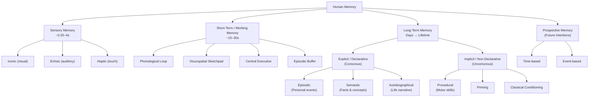

# Human Memory: A Multi-Component System

> **Verdict: Confirmed.** Humans do not have a single type of memory. Decades of cognitive psychology and neuroscience research overwhelmingly support the classification of human memory as a complex, multi-component system with distinct stages, types, and neural substrates.

---

## 1. The Foundational Model: Atkinson–Shiffrin (1968)

The dominant framework for understanding memory's architecture is the **multi-store model** (also called the **modal model**), proposed by Richard Atkinson and Richard Shiffrin in 1968. It describes memory as a linear flow through three distinct stages based on duration:

```
Environment → [Sensory Register] → Attention → [Short-Term Store] → Rehearsal → [Long-Term Store]
                   ~0.25–4s                        ~15–30s                       Days → Lifetime
```

This model, while later refined and challenged for its linearity, remains the foundational taxonomy and is corroborated across every major source consulted.

**Sources:** Wikipedia (Atkinson–Shiffrin model); Simply Psychology; Lumen Learning; NIH (NCBI)

---

## 2. Sensory Memory

The briefest form of memory. Acts as a raw buffer for incoming stimuli before any conscious processing occurs. It is **automatic** and **pre-categorical** — information is held as an unprocessed sensory trace.

| Subtype | Modality | Duration | Discovered By |
|---|---|---|---|
| **Iconic Memory** | Visual | ~250 ms – 1 second | George Sperling (1960) |
| **Echoic Memory** | Auditory | ~3 – 4 seconds | Ulric Neisser (1967) |
| **Haptic Memory** | Tactile (touch, pressure, pain) | ~1 – 2 seconds | — |
| Gustatory | Taste | Brief (less studied) | — |
| Olfactory | Smell | Brief (less studied) | — |

**Key characteristics:**
- **High capacity** — captures nearly everything in the perceptual field
- **Rapid decay** — most information is lost within milliseconds unless attention is directed to it
- **Modality-specific** — each sense has its own register
- **Automatic** — no conscious effort required

Sperling's classic **partial report paradigm** (1960) demonstrated iconic memory's existence by showing that participants could recall any row of a briefly flashed letter grid when cued immediately, but lost this ability after ~300 ms.

**Sources:** Cleveland Clinic; Simply Psychology; Sperling (1960); Neisser (1967); KnowledgeOne

---

## 3. Short-Term Memory (STM)

Short-term memory holds a limited amount of information in an active, readily accessible state for a brief period.

**Capacity:** George A. Miller's landmark 1956 paper, *"The Magical Number Seven, Plus or Minus Two"*, established that STM can hold approximately **7 ± 2 items** (chunks). Modern research by Nelson Cowan (2001) has revised this estimate downward to approximately **4 ± 1 chunks** for pure working memory capacity.

**Duration:** Without rehearsal, information decays within approximately **15–30 seconds** (Peterson & Peterson, 1959).

**Maintenance mechanism:** Rehearsal — either maintenance rehearsal (repetition) or elaborative rehearsal (meaningful processing).

**Sources:** Miller (1956), *Psychological Review*; Peterson & Peterson (1959); Cowan (2001); KnowledgeOne

---

## 4. Working Memory: Beyond Simple Storage

Working memory is **not** simply a synonym for short-term memory, though the terms are often used interchangeably in casual contexts. Working memory is more accurately defined as the **active manipulation and processing** of information held in temporary storage.

### Baddeley & Hitch Model (1974, revised 2000)

Alan Baddeley and Graham Hitch proposed that working memory is a **multi-component system**, not a single unitary store:

```
                    ┌─────────────────────┐
                    │  Central Executive   │  ← Attentional control, coordination
                    │  (supervisory system)│
                    └───┬──────┬──────┬───┘
                        │      │      │
              ┌─────────▼──┐ ┌─▼────────────┐ ┌─▼──────────────┐
              │ Phonological│ │ Visuospatial  │ │   Episodic     │
              │    Loop     │ │  Sketchpad    │ │   Buffer       │
              │ (inner ear/ │ │ (mind's eye)  │ │ (added 2000)   │
              │  inner voice)│ │               │ │                │
              └─────────────┘ └───────────────┘ └────────────────┘
```

| Component | Function | Example |
|---|---|---|
| **Central Executive** | Attentional control, task-switching, resource allocation | Deciding what to focus on in a noisy room |
| **Phonological Loop** | Verbal/auditory rehearsal and storage | Repeating a phone number in your head |
| **Visuospatial Sketchpad** | Visual/spatial imagery and manipulation | Mentally rotating an object; navigating a route |
| **Episodic Buffer** | Integrates information across subsystems and long-term memory | Following the plot of a story; mental time travel |

Working memory is primarily associated with the **prefrontal cortex**.

**Sources:** Baddeley & Hitch (1974); Baddeley (2000); Simply Psychology; Wikipedia; SAGE Publications

---

## 5. Long-Term Memory (LTM)

Long-term memory has a virtually **unlimited capacity** and can persist for days, decades, or an entire lifetime. It is the system responsible for the durable encoding of knowledge and experience.

LTM is divided into two major categories based on whether recall is **conscious** (explicit) or **unconscious** (implicit):

### 5.1 Explicit (Declarative) Memory — "Knowing That"

Requires **conscious recall**. You can declare or verbalize what you know.

| Subtype | Definition | Example | Brain Region |
|---|---|---|---|
| **Episodic Memory** | Personal experiences tied to a specific time and place | Remembering your graduation day | Hippocampus, medial temporal lobe |
| **Semantic Memory** | General world knowledge and facts, detached from personal context | Knowing Paris is the capital of France | Temporal cortex, distributed neocortex |

Endel Tulving (1972) first drew the critical distinction between episodic and semantic memory, a classification now universally accepted.

### 5.2 Implicit (Non-Declarative) Memory — "Knowing How"

Does **not** require conscious awareness. These memories influence behavior automatically.

| Subtype | Definition | Example | Brain Region |
|---|---|---|---|
| **Procedural Memory** | Motor skills and "how-to" knowledge | Riding a bike, typing, playing piano | Cerebellum, basal ganglia |
| **Priming** | Prior exposure to a stimulus influences response to a later stimulus | Hearing "bread" makes you faster to identify "butter" | Neocortex |
| **Classical Conditioning** | Learned associations between stimuli | A specific song triggering nostalgia | Amygdala, cerebellum |

### 5.3 Autobiographical Memory — A Hybrid

Autobiographical memory is a **higher-order integration** of episodic and semantic memory that forms a person's coherent **life narrative and identity**. It includes:

- **Lifetime periods** (semantic knowledge: "when I lived in New York")
- **General events** (repeated/extended: "Sunday dinners at grandma's house")
- **Event-specific knowledge** (episodic: sensory details of a particular dinner)

Martin Conway's **Self-Memory System** (2005) models autobiographical memory as a hierarchical structure linking personal goals, self-knowledge, and episodic specifics.

**Sources:** Tulving (1972); Conway (2005); KnowledgeOne; Cleveland Clinic; NIH (NCBI); Verywell Mind

---

## 6. Prospective Memory — "Remembering to Remember"

While most memory research focuses on **retrospective** memory (recalling the past), **prospective memory** is the ability to remember to carry out a planned action **in the future**.

| Subtype | Trigger | Example |
|---|---|---|
| **Time-based** | A specific time or after a duration | Taking medication at 8:00 PM |
| **Event-based** | A specific environmental cue | Remembering to give a message to someone when you see them |

Prospective memory failures are among the most common memory complaints in everyday life ("I forgot to buy milk"). It relies on the **prefrontal cortex** for monitoring and the **hippocampus** for maintaining the intention.

**Sources:** Psychology Today; Wikipedia (Prospective memory); EBSCO; BetterHelp

---

## 7. Neural Architecture of Memory

Memory is not localized to a single brain region. It is a **distributed process** involving a network of structures, each contributing different functions:

```
┌──────────────────────────────────────────────────────────────────────────┐
│                        MEMORY NEURAL NETWORK                            │
├─────────────────────┬───────────────────────────────────────────────────┤
│  Hippocampus        │ Memory consolidation hub; converts STM → LTM;    │
│                     │ critical for declarative/episodic memory;         │
│                     │ spatial navigation                                │
├─────────────────────┼───────────────────────────────────────────────────┤
│  Prefrontal Cortex  │ Working memory; executive control; planning;     │
│                     │ long-term contextual memory retrieval             │
├─────────────────────┼───────────────────────────────────────────────────┤
│  Neocortex          │ Long-term storage of semantic memories;           │
│  (distributed)      │ priming; gradual consolidation from hippocampus  │
├─────────────────────┼───────────────────────────────────────────────────┤
│  Amygdala           │ Emotional memory; fear conditioning;              │
│                     │ modulates hippocampal encoding (emotional boost)  │
├─────────────────────┼───────────────────────────────────────────────────┤
│  Cerebellum         │ Procedural/motor memory; classical conditioning;  │
│                     │ timing and sequencing of learned movements        │
├─────────────────────┼───────────────────────────────────────────────────┤
│  Basal Ganglia      │ Habit formation; procedural learning;             │
│                     │ reward-based learning                             │
└─────────────────────┴───────────────────────────────────────────────────┘
```

The famous case of **Patient H.M.** (Henry Molaison, 1953) — who had his hippocampi surgically removed and could no longer form new declarative memories but retained procedural learning — provided landmark evidence that these memory systems are neurologically distinct.

**Sources:** NIH (NCBI); Lumen Learning; CUNY; Scoville & Milner (1957)

---

## 8. Complete Taxonomy



---

## 9. Verification Summary

| Claim | Verified? | Notes |
|---|---|---|
| Memory is a multi-component system, not a single type | ✅ Yes | Universally supported across all sources |
| Three main stages: sensory, short-term, long-term | ✅ Yes | Atkinson–Shiffrin (1968); standard textbook model |
| Sensory memory subtypes: iconic, echoic, haptic | ✅ Yes | Sperling (1960); Neisser (1967); Cleveland Clinic |
| STM capacity: ~5–9 items | ✅ Yes* | Miller (1956) said 7±2; modern estimates lean toward 4±1 chunks |
| STM duration: ~15–30 seconds | ✅ Yes | Peterson & Peterson (1959) |
| Working memory ≠ short-term memory (involves active manipulation) | ✅ Yes | Baddeley & Hitch (1974) |
| LTM divided into explicit and implicit | ✅ Yes | Tulving (1972); Squire (1992) |
| Explicit → episodic + semantic | ✅ Yes | Tulving (1972) |
| Implicit → procedural + priming + conditioning | ✅ Yes | Squire (1992); Lumen Learning |
| Autobiographical memory is an episodic–semantic hybrid | ✅ Yes | Conway (2005); KnowledgeOne |
| Prospective memory ("remembering to remember") | ✅ Yes | Psychology Today; Wikipedia |
| Brain regions: hippocampus, neocortex, cerebellum, amygdala, PFC | ✅ Yes | NIH; Lumen Learning; Patient H.M. case |

---

## 10. Key References

| Reference | Year | Contribution |
|---|---|---|
| Miller, G.A. — *"The Magical Number Seven"* | 1956 | STM capacity limits |
| Sperling, G. — Partial report paradigm | 1960 | Demonstrated iconic memory |
| Scoville & Milner — Patient H.M. | 1957 | Hippocampal role in declarative memory |
| Atkinson & Shiffrin — Multi-store model | 1968 | Three-stage memory architecture |
| Tulving, E. — Episodic vs. semantic memory | 1972 | Declarative memory subtypes |
| Baddeley & Hitch — Working memory model | 1974 | Multi-component working memory |
| Squire, L.R. — Declarative vs. non-declarative memory | 1992 | Explicit/implicit taxonomy |
| Baddeley, A. — Episodic buffer | 2000 | Revised working memory model |
| Cowan, N. — Working memory capacity | 2001 | Revised capacity to ~4 chunks |
| Conway, M.A. — Self-Memory System | 2005 | Autobiographical memory structure |

### Web Sources Consulted

- Cleveland Clinic — *Types of Memory*
- Simply Psychology — *Atkinson & Shiffrin*, *Working Memory*, *Sensory Memory*
- Wikipedia — *Memory*, *Atkinson–Shiffrin model*, *Prospective memory*, *Working memory*
- KnowledgeOne (knowledgeone.ca) — *Types of Memory*, *Long-Term Memory*
- Verywell Mind — *Types of Memory*
- Lumen Learning — *Memory stages and brain regions*
- NIH / NCBI — Multiple publications on memory consolidation and neural substrates
- Psychology Today — *Prospective memory*, *Implicit memory*
